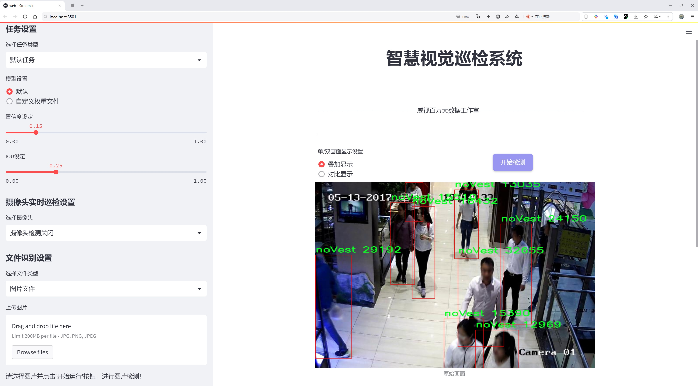
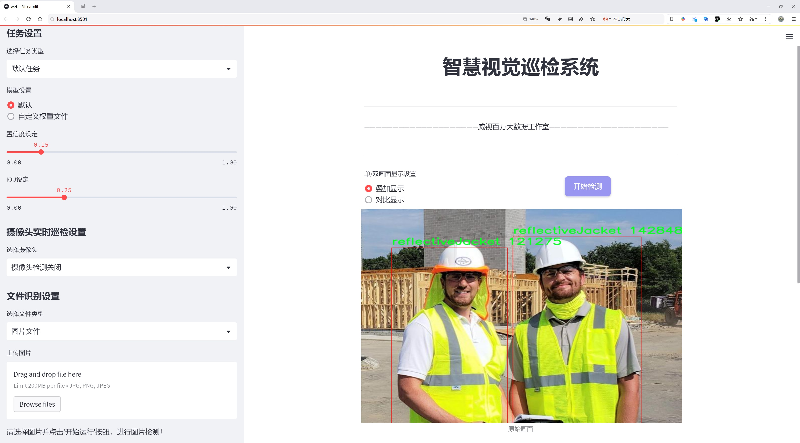
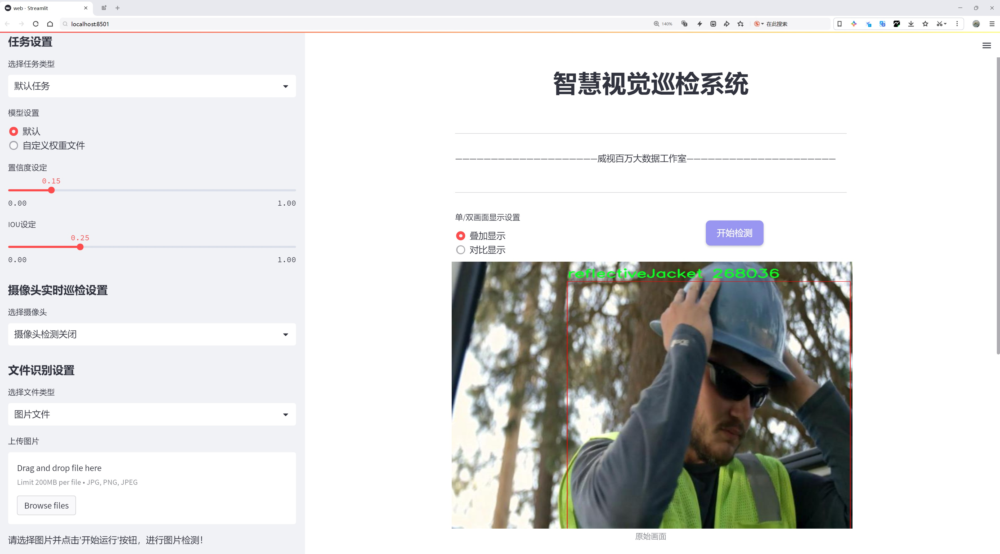
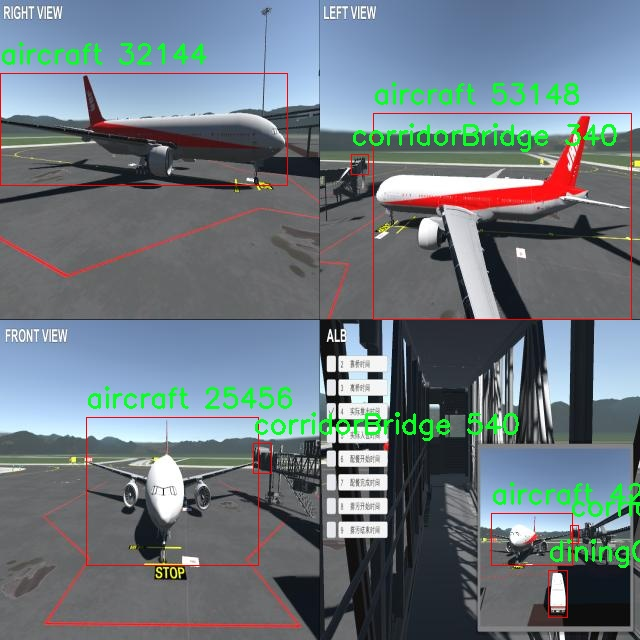
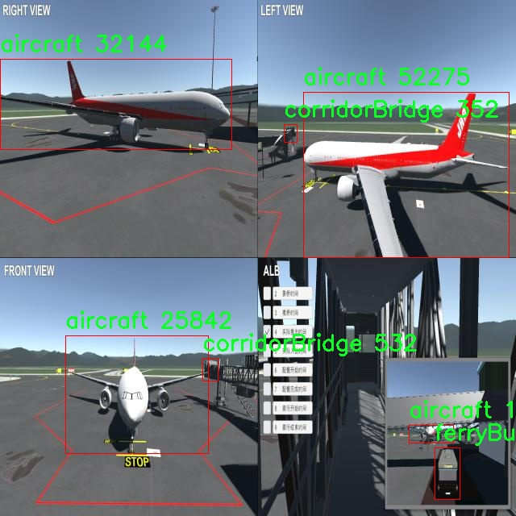
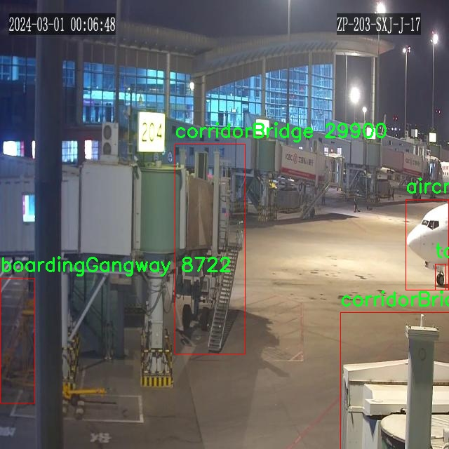
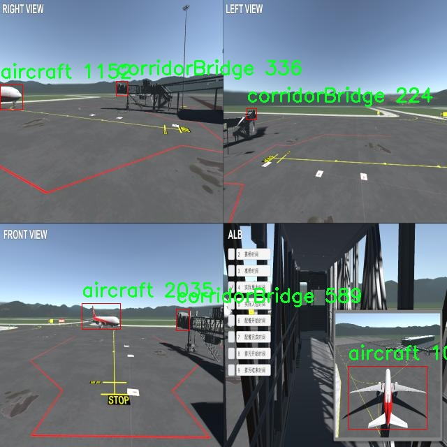
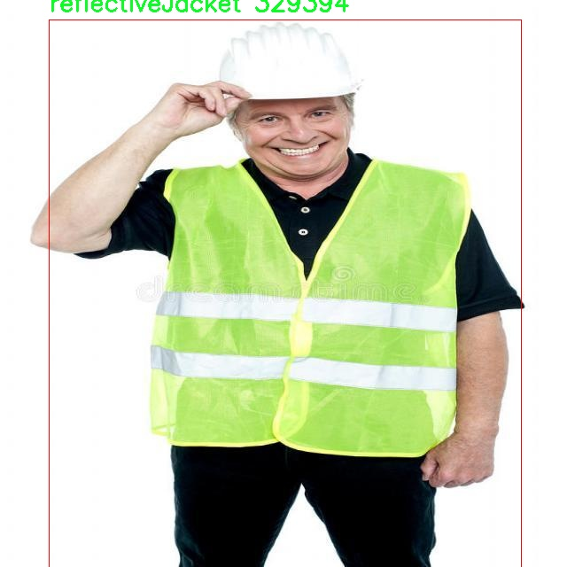

# 机场场景目标检测（反光衣、人员、特种设备等）检测系统源码分享
 # [一条龙教学YOLOV8标注好的数据集一键训练_70+全套改进创新点发刊_Web前端展示]

### 1.研究背景与意义

项目参考[AAAI Association for the Advancement of Artificial Intelligence](https://gitee.com/qunshansj/projects)

项目来源[AACV Association for the Advancement of Computer Vision](https://gitee.com/qunmasj/projects)

研究背景与意义

随着全球航空运输业的迅猛发展，机场作为航空运输的关键节点，其安全管理和运营效率愈发受到重视。在机场场景中，人员、设备及交通工具的高效识别与管理是确保机场安全和顺畅运营的重要环节。尤其是在复杂的机场环境中，反光衣的穿着、特种设备的使用以及人员的活动，均对机场的安全和服务质量产生直接影响。因此，构建一个高效、准确的目标检测系统，以实现对机场场景中各类目标的实时监测与识别，具有重要的现实意义。

近年来，深度学习技术的快速发展为目标检测任务提供了新的解决方案。YOLO（You Only Look Once）系列模型因其高效的实时检测能力和良好的检测精度，成为目标检测领域的热门选择。YOLOv8作为该系列的最新版本，进一步提升了检测性能，适应了更为复杂的场景。然而，尽管YOLOv8在一般场景下表现优异，但在特定的机场环境中，仍面临着诸如目标遮挡、光照变化及目标种类繁多等挑战。因此，基于改进YOLOv8的机场场景目标检测系统的研究，具有重要的理论和实践价值。

本研究的核心在于利用名为“apronVision”的数据集，该数据集包含4800张图像，涵盖18个类别的目标，包括飞机、行李车、登机桥、传送带、餐车、特种车辆及反光衣等。这些目标在机场场景中频繁出现，且各类目标的外观、尺寸和形态差异显著，为目标检测系统的训练和评估提供了丰富的样本。通过对该数据集的深入分析与处理，结合YOLOv8的优势，研究将着重于提升系统在机场特定场景下的检测精度和速度。

在研究过程中，改进YOLOv8的关键在于优化网络结构和训练策略，以适应机场环境的复杂性。例如，可以通过数据增强技术来扩展训练样本的多样性，利用迁移学习方法来提升模型在特定类别（如反光衣和特种设备）上的识别能力。此外，考虑到机场场景的实时性需求，研究还将探索模型压缩和加速的方法，以确保目标检测系统能够在实际应用中实现快速响应。

本研究的意义不仅在于提升机场场景下目标检测的准确性和效率，更在于为机场安全管理提供科学依据。通过实时监测和识别机场内的各类目标，能够有效预防安全隐患，提升应急响应能力，保障航空运输的安全与顺畅。此外，研究成果还可为其他复杂场景下的目标检测提供借鉴，推动智能监控技术在更多领域的应用。因此，基于改进YOLOv8的机场场景目标检测系统的研究，具有重要的学术价值和广泛的应用前景。

### 2.图片演示







##### 注意：由于此博客编辑较早，上面“2.图片演示”和“3.视频演示”展示的系统图片或者视频可能为老版本，新版本在老版本的基础上升级如下：（实际效果以升级的新版本为准）

  （1）适配了YOLOV8的“目标检测”模型和“实例分割”模型，通过加载相应的权重（.pt）文件即可自适应加载模型。

  （2）支持“图片识别”、“视频识别”、“摄像头实时识别”三种识别模式。

  （3）支持“图片识别”、“视频识别”、“摄像头实时识别”三种识别结果保存导出，解决手动导出（容易卡顿出现爆内存）存在的问题，识别完自动保存结果并导出到tempDir中。

  （4）支持Web前端系统中的标题、背景图等自定义修改，后面提供修改教程。

  另外本项目提供训练的数据集和训练教程,暂不提供权重文件（best.pt）,需要您按照教程进行训练后实现图片演示和Web前端界面演示的效果。

### 3.视频演示

[3.1 视频演示](https://www.bilibili.com/video/BV1Dr4YeMEFu/)

### 4.数据集信息展示

##### 4.1 本项目数据集详细数据（类别数＆类别名）

nc: 17
names: ['aircraft', 'baggageCar', 'boardingGangway', 'conveyor', 'corridorBridge', 'diningCar', 'ferryBus', 'followMe', 'groundSupportVehicle', 'noVest', 'oilTankTruck', 'reflectiveJacket', 'sewageTruck', 'toApplyWheelChocks', 'toRemoveWheelChocks', 'tractor', 'trolley']


##### 4.2 本项目数据集信息介绍

数据集信息展示

在现代机场运营中，目标检测技术的应用愈发重要，尤其是在复杂的机场场景中，能够有效识别和分类不同的目标是提升安全性和效率的关键。为此，我们构建了一个名为“apronVision”的数据集，旨在为改进YOLOv8模型在机场场景中的目标检测能力提供支持。该数据集专注于机场地面操作的多样性，涵盖了17个不同的类别，确保了对机场环境中各种目标的全面覆盖。

“apronVision”数据集的类别包括：飞机（aircraft）、行李车（baggageCar）、登机廊桥（boardingGangway）、传送带（conveyor）、走廊桥（corridorBridge）、餐车（diningCar）、渡轮巴士（ferryBus）、跟随我车（followMe）、地面支持车辆（groundSupportVehicle）、无反光衣人员（noVest）、油罐车（oilTankTruck）、反光衣（reflectiveJacket）、污水车（sewageTruck）、应用轮挡（toApplyWheelChocks）、移除轮挡（toRemoveWheelChocks）、拖拉机（tractor）和手推车（trolley）。这些类别不仅涵盖了机场日常运营中常见的设备和人员，还特别关注了安全和管理方面的需求，例如反光衣的识别，确保在复杂环境中人员的可见性和安全性。

在数据集的构建过程中，我们收集了大量的图像数据，涵盖了不同时间、天气和光照条件下的机场场景。这种多样性使得“apronVision”数据集能够有效模拟真实世界中的各种情况，增强模型的鲁棒性。每个类别的图像都经过精心标注，确保了高质量的训练数据，帮助YOLOv8模型在实际应用中实现更高的检测精度。

为了满足不同研究和应用的需求，我们还对数据集进行了多种预处理和增强操作，包括图像缩放、旋转、裁剪以及颜色调整等。这些操作不仅增加了数据集的多样性，还有效提升了模型的泛化能力，使其能够在面对未知场景时依然保持良好的性能。

此外，我们在数据集的设计中考虑到了实际应用中的场景复杂性。例如，在机场这样一个动态环境中，目标之间的相互遮挡、不同目标的相似外观以及光照变化等因素都可能影响目标检测的准确性。因此，“apronVision”数据集中的图像不仅包含单一目标的清晰图像，还包括多目标交互和遮挡的场景，以帮助模型学习如何在复杂情况下进行有效的目标识别。

总之，“apronVision”数据集为改进YOLOv8在机场场景中的目标检测提供了一个丰富而多样的基础。通过对机场环境中各类目标的全面覆盖和高质量的标注，该数据集不仅有助于提升目标检测的准确性和效率，也为未来的研究和应用提供了宝贵的数据支持。我们期待通过这一数据集的应用，推动机场安全管理和运营效率的进一步提升。











### 5.全套项目环境部署视频教程（零基础手把手教学）

[5.1 环境部署教程链接（零基础手把手教学）](https://www.ixigua.com/7404473917358506534?logTag=c807d0cbc21c0ef59de5)


[5.2 安装Python虚拟环境创建和依赖库安装视频教程链接（零基础手把手教学）](https://www.ixigua.com/7404474678003106304?logTag=1f1041108cd1f708b01a)

### 6.手把手YOLOV8训练视频教程（零基础小白有手就能学会）

[6.1 手把手YOLOV8训练视频教程（零基础小白有手就能学会）](https://www.ixigua.com/7404477157818401292?logTag=d31a2dfd1983c9668658)

### 7.70+种全套YOLOV8创新点代码加载调参视频教程（一键加载写好的改进模型的配置文件）

[7.1 70+种全套YOLOV8创新点代码加载调参视频教程（一键加载写好的改进模型的配置文件）](https://www.ixigua.com/7404478314661806627?logTag=29066f8288e3f4eea3a4)

### 8.70+种全套YOLOV8创新点原理讲解（非科班也可以轻松写刊发刊，V10版本正在科研待更新）

由于篇幅限制，每个创新点的具体原理讲解就不一一展开，具体见下列网址中的创新点对应子项目的技术原理博客网址【Blog】：


[8.1 70+种全套YOLOV8创新点原理讲解链接](https://gitee.com/qunmasj/good)

### 9.系统功能展示（检测对象为举例，实际内容以本项目数据集为准）

图9.1.系统支持检测结果表格显示

  图9.2.系统支持置信度和IOU阈值手动调节

  图9.3.系统支持自定义加载权重文件best.pt(需要你通过步骤5中训练获得)

  图9.4.系统支持摄像头实时识别

  图9.5.系统支持图片识别

  图9.6.系统支持视频识别

  图9.7.系统支持识别结果文件自动保存

  图9.8.系统支持Excel导出检测结果数据


### 10.原始YOLOV8算法原理

原始YOLOv8算法原理

YOLOv8模型是由Ultralytics团队在YOLOv5的基础上发展而来的，旨在通过吸收近两年半内的各种实证改进，进一步提升目标检测的性能。该模型于2023年1月正式发布，标志着YOLO系列的又一次重要进步。YOLOv8不仅在结构上进行了优化，还在训练策略和损失函数的设计上进行了创新，以实现更高的检测精度和更快的推理速度。

YOLOv8模型的结构可以分为三个主要部分：输入端、主干网络和检测头。以YOLOv8n为例，输入端首先对图像进行预处理，随后进入主干网络进行特征提取。与前代模型相比，YOLOv8在主干网络的设计上进行了重要的改进，尤其是C3模块被C2f模块所替代。C2f模块引入了YOLOv7中的ELAN（Efficient Layer Aggregation Network）思想，增加了更多的跳层连接，这不仅增强了模型的梯度流动性，还在保证轻量化的前提下，提升了特征的表达能力。C2f模块通过分支结构将输入特征图进行处理，能够更有效地捕捉到图像中的重要信息，从而为后续的目标检测提供更为丰富的特征。

在颈部网络部分，YOLOv8同样将所有的C3模块替换为C2f模块，并且删除了两处上采样之前的卷积连接层。这一改动使得模型在特征融合时更加高效，减少了不必要的计算开销。颈部网络的设计旨在通过特征金字塔网络（FPN）和路径聚合网络（PAN）结构，增强不同尺度特征的融合能力，以便更好地处理各种尺寸的目标。

检测头部分是YOLOv8的一大亮点。该部分采用了解耦头的设计理念，将分类和定位任务分开处理。通过并行的两个分支，模型能够分别提取类别特征和位置特征，这种分离使得分类任务能够更专注于特征图中的类别相似性，而定位任务则关注边界框与真实框之间的关系。这种设计不仅提高了模型的收敛速度，还提升了最终的预测精度。此外，YOLOv8采用了无锚框结构，直接预测目标的中心点和宽高比例，简化了传统锚框的设计，进而提高了检测速度和准确性。

在训练过程中，YOLOv8对数据增强策略进行了优化。尽管Mosaic数据增强在一定程度上提高了模型的鲁棒性和泛化能力，但在训练的最后10个epoch中，YOLOv8停止使用该增强方式，以避免对数据真实分布的破坏。这样的策略确保了模型在训练后期能够更好地学习到真实数据的特征，进而提升检测性能。

在损失函数的设计上，YOLOv8引入了BCELoss作为分类损失，同时结合DFLLoss和CIoULoss作为回归损失。通过引入任务对齐学习（Task Alignment Learning, TAL），YOLOv8在分类和定位损失函数中加入了分类分数和IOU的高次幂乘积作为衡量任务对齐程度的指标。这一创新使得模型在训练过程中能够更好地平衡分类和定位的性能，最终实现更高的mAP（mean Average Precision）值。

YOLOv8在检测性能上也取得了显著的成果。根据官方在COCO数据集上的测试结果，YOLOv8在不同尺寸的模型中，在参数量没有显著增加的情况下，取得了比其他模型更好的精度和更快的推理速度。这使得YOLOv8在实时性和准确性之间找到了良好的平衡，特别适合于需要快速响应的应用场景，如自动驾驶、安防监控和机器人视觉等。

综上所述，YOLOv8模型通过一系列结构上的创新和训练策略的优化，显著提升了目标检测的性能。其轻量化的设计和高效的特征提取能力，使得YOLOv8在实际应用中展现出极大的潜力和价值。随着技术的不断进步，YOLOv8无疑将在目标检测领域继续发挥重要作用，推动相关研究和应用的发展。


### 11.项目核心源码讲解（再也不用担心看不懂代码逻辑）

#### 11.1 ui.py

以下是对代码的核心部分进行保留和详细注释的版本：

```python
import sys
import subprocess

def run_script(script_path):
    """
    使用当前 Python 环境运行指定的脚本。

    Args:
        script_path (str): 要运行的脚本路径

    Returns:
        None
    """
    # 获取当前 Python 解释器的路径
    python_path = sys.executable

    # 构建运行命令，使用 streamlit 运行指定的脚本
    command = f'"{python_path}" -m streamlit run "{script_path}"'

    # 执行命令
    result = subprocess.run(command, shell=True)
    
    # 检查命令执行的返回码，如果不为0，表示出错
    if result.returncode != 0:
        print("脚本运行出错。")

# 主程序入口
if __name__ == "__main__":
    # 指定要运行的脚本路径
    script_path = "web.py"  # 这里可以直接指定脚本名称

    # 调用函数运行脚本
    run_script(script_path)
```

### 代码分析与注释

1. **导入模块**：
   - `sys`：用于访问与 Python 解释器相关的变量和函数。
   - `subprocess`：用于创建新进程、连接到它们的输入/输出/错误管道，并获得返回码。

2. **`run_script` 函数**：
   - 该函数接收一个脚本路径作为参数，并在当前 Python 环境中运行该脚本。
   - 使用 `sys.executable` 获取当前 Python 解释器的路径，以确保脚本在正确的环境中运行。
   - 使用 `subprocess.run` 执行构建的命令，并检查返回码以判断脚本是否成功运行。

3. **主程序入口**：
   - 使用 `if __name__ == "__main__":` 确保只有在直接运行该脚本时才会执行下面的代码。
   - 指定要运行的脚本路径（在这里是 `web.py`）。
   - 调用 `run_script` 函数，传入脚本路径以执行该脚本。

### 总结
这段代码的核心功能是通过当前 Python 环境运行指定的脚本，并且能够检测到脚本运行中的错误。

这个文件名为 `ui.py`，它的主要功能是通过当前的 Python 环境来运行一个指定的脚本，具体是一个名为 `web.py` 的文件。首先，文件导入了几个必要的模块，包括 `sys`、`os` 和 `subprocess`，这些模块分别用于系统操作、文件路径处理和执行外部命令。

在文件中定义了一个名为 `run_script` 的函数，该函数接受一个参数 `script_path`，表示要运行的脚本的路径。函数内部首先获取当前 Python 解释器的路径，这通过 `sys.executable` 实现。接着，构建一个命令字符串，使用 `streamlit` 来运行指定的脚本。这个命令的格式是将 Python 解释器路径和脚本路径组合在一起，形成一个完整的命令。

然后，使用 `subprocess.run` 方法来执行这个命令。`shell=True` 参数表示命令将在一个新的 shell 中执行。执行完命令后，函数检查返回的结果码，如果结果码不为零，说明脚本运行过程中出现了错误，此时会打印出一条错误信息。

在文件的最后部分，使用 `if __name__ == "__main__":` 语句来确保当该文件作为主程序运行时，以下代码才会被执行。这里指定了要运行的脚本路径为 `web.py`，并调用 `run_script` 函数来执行这个脚本。

总的来说，这个程序的作用是提供一个简单的接口，通过当前的 Python 环境来运行一个特定的 Streamlit 脚本，方便用户进行 Web 应用的开发和测试。

#### 11.2 70+种YOLOv8算法改进源码大全和调试加载训练教程（非必要）\ultralytics\engine\validator.py

以下是代码中最核心的部分，并附上详细的中文注释：

```python
class BaseValidator:
    """
    BaseValidator类是用于创建验证器的基类。

    属性:
        args (SimpleNamespace): 验证器的配置。
        dataloader (DataLoader): 用于验证的数据加载器。
        model (nn.Module): 要验证的模型。
        device (torch.device): 用于验证的设备。
        speed (dict): 包含预处理、推理、损失和后处理的处理时间。
        save_dir (Path): 保存结果的目录。
    """

    def __init__(self, dataloader=None, save_dir=None, args=None):
        """
        初始化BaseValidator实例。

        参数:
            dataloader (torch.utils.data.DataLoader): 用于验证的数据加载器。
            save_dir (Path, optional): 保存结果的目录。
            args (SimpleNamespace): 验证器的配置。
        """
        self.args = get_cfg(overrides=args)  # 获取配置
        self.dataloader = dataloader  # 数据加载器
        self.model = None  # 模型初始化为None
        self.device = None  # 设备初始化为None
        self.save_dir = save_dir or get_save_dir(self.args)  # 设置保存目录
        self.speed = {'preprocess': 0.0, 'inference': 0.0, 'loss': 0.0, 'postprocess': 0.0}  # 初始化速度字典

    @smart_inference_mode()
    def __call__(self, trainer=None, model=None):
        """支持验证预训练模型或正在训练的模型。"""
        self.device = select_device(self.args.device)  # 选择设备
        model = AutoBackend(model or self.args.model, device=self.device)  # 初始化模型
        model.eval()  # 设置模型为评估模式

        # 处理数据加载器
        self.dataloader = self.dataloader or self.get_dataloader(self.args.data, self.args.batch)

        # 运行验证过程
        for batch_i, batch in enumerate(self.dataloader):
            # 预处理
            batch = self.preprocess(batch)

            # 推理
            preds = model(batch['img'])

            # 更新指标
            self.update_metrics(preds, batch)

        # 获取统计信息
        stats = self.get_stats()
        self.print_results()  # 打印结果
        return stats  # 返回统计信息

    def preprocess(self, batch):
        """预处理输入批次。"""
        return batch  # 返回原始批次（可以在这里添加实际的预处理逻辑）

    def update_metrics(self, preds, batch):
        """根据预测和批次更新指标。"""
        pass  # 在这里实现指标更新逻辑

    def get_stats(self):
        """返回模型性能的统计信息。"""
        return {}  # 返回空字典（可以在这里添加实际的统计逻辑）

    def print_results(self):
        """打印模型预测的结果。"""
        pass  # 在这里实现结果打印逻辑
```

### 代码说明：
1. **BaseValidator类**：这是一个基类，用于实现YOLO模型的验证功能。它包含了初始化和验证过程的基本框架。
2. **初始化方法**：在初始化时，获取配置、设置数据加载器、模型和设备，并初始化保存目录和速度字典。
3. **调用方法**：这是主要的验证过程。根据传入的模型或训练器，选择设备并初始化模型，设置为评估模式。然后遍历数据加载器，进行预处理、推理和指标更新。
4. **预处理方法**：用于处理输入批次，当前实现为直接返回原始批次，可以在此添加实际的预处理逻辑。
5. **更新指标方法**：根据模型的预测结果和输入批次更新性能指标，当前未实现具体逻辑。
6. **获取统计信息方法**：返回模型性能的统计信息，当前返回空字典，可以在此添加实际的统计逻辑。
7. **打印结果方法**：用于打印模型的预测结果，当前未实现具体逻辑。

这些核心部分构成了验证器的基础框架，实际的实现可以根据具体需求进行扩展和完善。

这个程序文件是Ultralytics YOLO（You Only Look Once）模型的一个验证器类，主要用于在测试集或验证集上评估模型的准确性。文件中包含了类的定义、初始化方法以及多个辅助方法，旨在支持模型的验证过程。

首先，文件开头的文档字符串说明了如何使用该验证器，包括命令行的用法示例，支持的模型格式（如PyTorch、ONNX、TensorRT等），这些格式的支持使得用户可以灵活地选择不同的模型进行验证。

`BaseValidator`类是验证器的基类，包含了多个属性和方法。类的属性包括配置参数、数据加载器、模型、设备信息、当前批次索引、类别名称、统计信息等。这些属性为验证过程提供了必要的信息和上下文。

在初始化方法中，验证器实例会根据传入的参数设置相应的属性，包括数据加载器、保存结果的目录、进度条等。它还会检查输入图像的尺寸，确保其符合要求。若未指定置信度阈值，则会将其设置为默认值0.001。

`__call__`方法是验证器的核心逻辑，支持对预训练模型或正在训练的模型进行验证。该方法首先判断模型是否在训练状态，并根据状态设置设备和数据集。接着，它会初始化进度条和性能指标，并开始遍历数据加载器中的每个批次。在每个批次中，程序会进行预处理、推理、损失计算和后处理，并更新性能指标。

在推理过程中，模型会根据输入的图像进行预测，计算损失并更新统计信息。若用户设置了绘图选项，程序还会在前几个批次中绘制验证样本和预测结果。验证结束后，程序会输出结果，并在需要时将预测结果保存为JSON格式。

此外，类中还定义了一些辅助方法，例如`match_predictions`用于将预测结果与真实标签进行匹配，`add_callback`和`run_callbacks`用于处理回调函数，`get_dataloader`和`build_dataset`用于获取数据加载器和构建数据集，`preprocess`和`postprocess`用于对输入批次和预测结果进行处理。

总体而言，这个文件提供了一个灵活且功能强大的框架，用于验证YOLO模型的性能，支持多种模型格式和灵活的配置选项，适合于各种计算机视觉任务的评估。

#### 11.3 code\ultralytics\models\yolo\segment\predict.py

以下是经过简化和注释的核心代码部分：

```python
# 导入必要的模块和类
from ultralytics.engine.results import Results
from ultralytics.models.yolo.detect.predict import DetectionPredictor
from ultralytics.utils import DEFAULT_CFG, ops

class SegmentationPredictor(DetectionPredictor):
    """
    SegmentationPredictor类，继承自DetectionPredictor类，用于基于分割模型的预测。
    """

    def __init__(self, cfg=DEFAULT_CFG, overrides=None, _callbacks=None):
        """初始化SegmentationPredictor，设置配置、覆盖参数和回调函数。"""
        super().__init__(cfg, overrides, _callbacks)  # 调用父类构造函数
        self.args.task = "segment"  # 设置任务类型为分割

    def postprocess(self, preds, img, orig_imgs):
        """对每个输入图像的预测结果进行后处理，包括非极大值抑制和掩膜处理。"""
        # 应用非极大值抑制，过滤掉低置信度的预测框
        p = ops.non_max_suppression(
            preds[0],  # 预测框
            self.args.conf,  # 置信度阈值
            self.args.iou,  # IOU阈值
            agnostic=self.args.agnostic_nms,  # 是否使用类别无关的NMS
            max_det=self.args.max_det,  # 最大检测框数量
            nc=len(self.model.names),  # 类别数量
            classes=self.args.classes,  # 选择的类别
        )

        # 如果输入图像不是列表，则将其转换为numpy数组
        if not isinstance(orig_imgs, list):
            orig_imgs = ops.convert_torch2numpy_batch(orig_imgs)

        results = []  # 存储处理后的结果
        proto = preds[1][-1] if len(preds[1]) == 3 else preds[1]  # 获取掩膜原型

        # 遍历每个预测结果
        for i, pred in enumerate(p):
            orig_img = orig_imgs[i]  # 获取原始图像
            img_path = self.batch[0][i]  # 获取图像路径
            
            if not len(pred):  # 如果没有检测到框
                masks = None  # 掩膜为None
            elif self.args.retina_masks:  # 如果使用Retina掩膜
                # 缩放预测框并处理掩膜
                pred[:, :4] = ops.scale_boxes(img.shape[2:], pred[:, :4], orig_img.shape)
                masks = ops.process_mask_native(proto[i], pred[:, 6:], pred[:, :4], orig_img.shape[:2])  # HWC
            else:  # 否则使用常规掩膜处理
                masks = ops.process_mask(proto[i], pred[:, 6:], pred[:, :4], img.shape[2:], upsample=True)  # HWC
                pred[:, :4] = ops.scale_boxes(img.shape[2:], pred[:, :4], orig_img.shape)  # 缩放预测框
            
            # 将结果存储到results列表中
            results.append(Results(orig_img, path=img_path, names=self.model.names, boxes=pred[:, :6], masks=masks))
        
        return results  # 返回处理后的结果
```

### 代码注释说明：
1. **导入模块**：导入必要的类和函数，以便后续使用。
2. **SegmentationPredictor类**：这是一个继承自DetectionPredictor的类，专门用于图像分割任务。
3. **构造函数**：初始化类时设置任务类型为“segment”，并调用父类的构造函数。
4. **后处理函数**：对模型的预测结果进行后处理，包括非极大值抑制、掩膜处理等。
5. **非极大值抑制**：过滤掉低置信度的检测框，以提高检测精度。
6. **掩膜处理**：根据预测结果生成相应的掩膜，并将结果存储在列表中，最后返回。

这个程序文件是Ultralytics YOLO模型中的一个分割预测类，名为`SegmentationPredictor`，它继承自`DetectionPredictor`类，专门用于基于分割模型进行预测。文件的开头部分引入了一些必要的模块和类，包括`Results`、`DetectionPredictor`和一些工具函数。

在`SegmentationPredictor`类的构造函数`__init__`中，首先调用了父类的构造函数，并传入配置、覆盖参数和回调函数。接着，它将任务类型设置为“segment”，表示该预测器的主要功能是进行图像分割。

`postprocess`方法是该类的核心功能之一，负责对模型的预测结果进行后处理。它接收预测结果、输入图像和原始图像作为参数。首先，使用非极大值抑制（NMS）来过滤掉重叠的检测框，保留置信度高的框。然后，检查输入的原始图像是否为列表格式，如果不是，则将其转换为NumPy数组格式。

接下来，程序根据预测结果的长度来处理掩膜数据。如果没有检测到任何物体，则掩膜设置为`None`。如果启用了“视网膜掩膜”选项，程序会对预测框进行缩放，并使用原生处理函数生成掩膜；否则，它会使用标准的掩膜处理函数。最后，程序将处理后的结果封装成`Results`对象，包括原始图像、图像路径、类别名称、检测框和掩膜，并将这些结果存储在一个列表中返回。

总的来说，这个文件实现了一个分割模型的预测功能，能够对输入图像进行处理并返回相应的分割结果，适用于图像分割任务。

#### 11.4 train.py

以下是经过简化和注释的核心代码部分：

```python
import random
import numpy as np
import torch.nn as nn
from ultralytics.data import build_dataloader, build_yolo_dataset
from ultralytics.engine.trainer import BaseTrainer
from ultralytics.models import yolo
from ultralytics.nn.tasks import DetectionModel
from ultralytics.utils import LOGGER, RANK
from ultralytics.utils.torch_utils import de_parallel, torch_distributed_zero_first

class DetectionTrainer(BaseTrainer):
    """
    扩展自 BaseTrainer 类，用于基于检测模型的训练。
    """

    def build_dataset(self, img_path, mode="train", batch=None):
        """
        构建 YOLO 数据集。

        参数:
            img_path (str): 包含图像的文件夹路径。
            mode (str): 模式，可以是 'train' 或 'val'，用于不同的数据增强。
            batch (int, optional): 批量大小，仅用于 'rect' 模式。默认为 None。
        """
        gs = max(int(de_parallel(self.model).stride.max() if self.model else 0), 32)
        return build_yolo_dataset(self.args, img_path, batch, self.data, mode=mode, rect=mode == "val", stride=gs)

    def get_dataloader(self, dataset_path, batch_size=16, rank=0, mode="train"):
        """构造并返回数据加载器。"""
        assert mode in ["train", "val"]
        with torch_distributed_zero_first(rank):  # 在 DDP 模式下仅初始化一次数据集
            dataset = self.build_dataset(dataset_path, mode, batch_size)
        shuffle = mode == "train"  # 训练模式下打乱数据
        workers = self.args.workers if mode == "train" else self.args.workers * 2
        return build_dataloader(dataset, batch_size, workers, shuffle, rank)  # 返回数据加载器

    def preprocess_batch(self, batch):
        """对图像批次进行预处理，包括缩放和转换为浮点数。"""
        batch["img"] = batch["img"].to(self.device, non_blocking=True).float() / 255  # 将图像归一化到 [0, 1]
        if self.args.multi_scale:  # 如果启用多尺度训练
            imgs = batch["img"]
            sz = (
                random.randrange(self.args.imgsz * 0.5, self.args.imgsz * 1.5 + self.stride)
                // self.stride
                * self.stride
            )  # 随机选择新的图像大小
            sf = sz / max(imgs.shape[2:])  # 计算缩放因子
            if sf != 1:
                ns = [
                    math.ceil(x * sf / self.stride) * self.stride for x in imgs.shape[2:]
                ]  # 计算新的形状
                imgs = nn.functional.interpolate(imgs, size=ns, mode="bilinear", align_corners=False)  # 进行插值
            batch["img"] = imgs
        return batch

    def get_model(self, cfg=None, weights=None, verbose=True):
        """返回 YOLO 检测模型。"""
        model = DetectionModel(cfg, nc=self.data["nc"], verbose=verbose and RANK == -1)
        if weights:
            model.load(weights)  # 加载权重
        return model

    def plot_training_samples(self, batch, ni):
        """绘制带有注释的训练样本。"""
        plot_images(
            images=batch["img"],
            batch_idx=batch["batch_idx"],
            cls=batch["cls"].squeeze(-1),
            bboxes=batch["bboxes"],
            paths=batch["im_file"],
            fname=self.save_dir / f"train_batch{ni}.jpg",
            on_plot=self.on_plot,
        )

    def plot_metrics(self):
        """从 CSV 文件中绘制指标。"""
        plot_results(file=self.csv, on_plot=self.on_plot)  # 保存结果图
```

### 代码说明：
1. **导入模块**：导入必要的库和模块，包括 PyTorch 和 Ultralytics 的相关组件。
2. **DetectionTrainer 类**：继承自 `BaseTrainer`，用于实现 YOLO 模型的训练过程。
3. **build_dataset 方法**：根据给定的图像路径和模式构建数据集，支持训练和验证模式。
4. **get_dataloader 方法**：构造数据加载器，处理数据集的初始化和批量大小设置。
5. **preprocess_batch 方法**：对输入的图像批次进行预处理，包括归一化和多尺度调整。
6. **get_model 方法**：返回一个 YOLO 检测模型，并可选择性地加载预训练权重。
7. **plot_training_samples 方法**：绘制训练样本及其对应的注释，便于可视化训练过程。
8. **plot_metrics 方法**：从 CSV 文件中读取并绘制训练指标，帮助监控训练效果。

这个程序文件 `train.py` 是一个用于训练 YOLO（You Only Look Once）目标检测模型的实现，基于 Ultralytics 的框架。文件中定义了一个名为 `DetectionTrainer` 的类，继承自 `BaseTrainer`，并包含了多个方法来支持模型的训练过程。

首先，类的构造函数并未显式列出，但可以推测其通过 `BaseTrainer` 的构造函数初始化一些基本参数。该类的主要功能是构建数据集、加载数据、预处理图像、设置模型属性、获取模型、验证模型、记录损失、显示训练进度、绘制训练样本和绘制训练指标。

在 `build_dataset` 方法中，程序根据给定的图像路径和模式（训练或验证）构建 YOLO 数据集。该方法还允许用户为不同模式自定义数据增强。`get_dataloader` 方法则负责构建数据加载器，确保在分布式训练中只初始化一次数据集，并根据模式设置是否打乱数据。

`preprocess_batch` 方法用于对图像批次进行预处理，包括将图像缩放到合适的大小并转换为浮点数。该方法支持多尺度训练，通过随机选择图像大小来增强模型的鲁棒性。

`set_model_attributes` 方法用于设置模型的属性，包括类别数量和类别名称，这些信息来自于数据集的配置。`get_model` 方法则用于返回一个 YOLO 检测模型，支持加载预训练权重。

在模型验证方面，`get_validator` 方法返回一个用于验证模型性能的 `DetectionValidator` 实例。`label_loss_items` 方法用于生成一个包含训练损失项的字典，方便记录和分析训练过程中的损失。

`progress_string` 方法生成一个格式化的字符串，显示训练进度，包括当前的 epoch、GPU 内存使用情况、损失值、实例数量和图像大小等信息。`plot_training_samples` 方法则用于绘制训练样本及其标注，便于可视化训练过程。

最后，`plot_metrics` 和 `plot_training_labels` 方法用于绘制训练过程中的指标和标签，帮助用户更好地理解模型的训练效果。

总体而言，这个文件实现了 YOLO 模型训练的各个方面，从数据准备到模型训练，再到结果可视化，提供了一个完整的训练流程。

#### 11.5 70+种YOLOv8算法改进源码大全和调试加载训练教程（非必要）\ultralytics\models\yolo\detect\train.py

以下是代码中最核心的部分，并附上详细的中文注释：

```python
class DetectionTrainer(BaseTrainer):
    """
    DetectionTrainer类，继承自BaseTrainer类，用于基于检测模型的训练。
    """

    def build_dataset(self, img_path, mode='train', batch=None):
        """
        构建YOLO数据集。

        参数:
            img_path (str): 包含图像的文件夹路径。
            mode (str): 模式，可以是'train'或'val'，用户可以为每种模式自定义不同的增强。
            batch (int, optional): 批次大小，仅用于'rect'模式。默认为None。
        """
        # 获取模型的最大步幅，并确保步幅至少为32
        gs = max(int(de_parallel(self.model).stride.max() if self.model else 0), 32)
        # 调用build_yolo_dataset函数构建数据集
        return build_yolo_dataset(self.args, img_path, batch, self.data, mode=mode, rect=mode == 'val', stride=gs)

    def get_dataloader(self, dataset_path, batch_size=16, rank=0, mode='train'):
        """构建并返回数据加载器。"""
        assert mode in ['train', 'val']  # 确保模式是'train'或'val'
        with torch_distributed_zero_first(rank):  # 在分布式训练中，仅初始化数据集一次
            dataset = self.build_dataset(dataset_path, mode, batch_size)  # 构建数据集
        shuffle = mode == 'train'  # 训练模式下打乱数据
        if getattr(dataset, 'rect', False) and shuffle:
            LOGGER.warning("WARNING ⚠️ 'rect=True'与DataLoader的shuffle不兼容，设置shuffle=False")
            shuffle = False  # 如果是rect模式，禁用shuffle
        workers = self.args.workers if mode == 'train' else self.args.workers * 2  # 设置工作线程数
        return build_dataloader(dataset, batch_size, workers, shuffle, rank)  # 返回数据加载器

    def preprocess_batch(self, batch):
        """对一批图像进行预处理，包括缩放和转换为浮点数。"""
        batch['img'] = batch['img'].to(self.device, non_blocking=True).float() / 255  # 将图像数据转换为浮点数并归一化
        return batch

    def set_model_attributes(self):
        """设置模型的属性，包括类别数量和类别名称。"""
        self.model.nc = self.data['nc']  # 将类别数量附加到模型
        self.model.names = self.data['names']  # 将类别名称附加到模型
        self.model.args = self.args  # 将超参数附加到模型

    def get_model(self, cfg=None, weights=None, verbose=True):
        """返回一个YOLO检测模型。"""
        model = DetectionModel(cfg, nc=self.data['nc'], verbose=verbose and RANK == -1)  # 创建检测模型
        if weights:
            model.load(weights)  # 加载权重
        return model

    def get_validator(self):
        """返回用于YOLO模型验证的DetectionValidator。"""
        self.loss_names = 'box_loss', 'cls_loss', 'dfl_loss'  # 定义损失名称
        return yolo.detect.DetectionValidator(self.test_loader, save_dir=self.save_dir, args=copy(self.args))  # 返回验证器

    def plot_training_samples(self, batch, ni):
        """绘制训练样本及其注释。"""
        plot_images(images=batch['img'],
                    batch_idx=batch['batch_idx'],
                    cls=batch['cls'].squeeze(-1),
                    bboxes=batch['bboxes'],
                    paths=batch['im_file'],
                    fname=self.save_dir / f'train_batch{ni}.jpg',
                    on_plot=self.on_plot)  # 绘制图像并保存

    def plot_metrics(self):
        """从CSV文件中绘制指标。"""
        plot_results(file=self.csv, on_plot=self.on_plot)  # 保存结果图像
```

### 代码核心部分说明：
1. **DetectionTrainer类**：该类用于训练YOLO检测模型，继承自BaseTrainer类，包含了数据集构建、数据加载、模型设置等功能。
2. **build_dataset方法**：根据给定的图像路径和模式构建YOLO数据集，支持训练和验证模式。
3. **get_dataloader方法**：构建数据加载器，负责将数据集加载到训练过程中，并支持分布式训练。
4. **preprocess_batch方法**：对输入的图像批次进行预处理，将图像数据转换为浮点数并进行归一化。
5. **set_model_attributes方法**：设置模型的类别数量和类别名称等属性。
6. **get_model方法**：返回一个YOLO检测模型，可以选择加载预训练权重。
7. **get_validator方法**：返回用于模型验证的检测验证器。
8. **plot_training_samples和plot_metrics方法**：用于可视化训练样本和训练指标，帮助监控训练过程。

该程序文件是一个用于训练YOLO（You Only Look Once）目标检测模型的Python脚本，属于Ultralytics YOLO框架的一部分。它继承自BaseTrainer类，专门用于处理目标检测任务。程序中包含了多个方法，用于构建数据集、获取数据加载器、预处理图像批次、设置模型属性、获取模型、进行验证、记录损失、输出训练进度、绘制训练样本和绘制训练指标等。

在构建数据集时，程序会根据给定的图像路径和模式（训练或验证）创建YOLO数据集，并允许用户自定义不同模式下的增强方法。数据加载器的构建则考虑了数据的随机打乱和工作线程的数量，以提高训练效率。

在预处理阶段，程序将图像批次转换为浮点数并进行归一化，以便模型能够更好地处理输入数据。模型属性的设置包括将类别数量和类别名称附加到模型上，以确保模型能够正确识别和分类目标。

获取YOLO检测模型的方法允许用户加载预训练权重，从而加速训练过程。验证器的获取则是为了在训练过程中对模型进行评估，记录损失值以便后续分析。

此外，程序还提供了记录和输出训练进度的功能，能够实时显示当前的训练状态，包括当前的轮次、GPU内存使用情况和损失值等。绘制训练样本和指标的功能则帮助用户可视化训练过程，便于分析模型的性能和改进方向。

总体而言，该文件为YOLO目标检测模型的训练提供了全面的支持，涵盖了从数据准备到模型评估的各个环节。

#### 11.6 70+种YOLOv8算法改进源码大全和调试加载训练教程（非必要）\ultralytics\models\sam\modules\__init__.py

```python
# Ultralytics YOLO 🚀, AGPL-3.0 license

# 该代码是YOLO（You Only Look Once）目标检测模型的实现部分
# YOLO是一种高效的实时目标检测算法，能够在单个前向传播中同时预测多个目标的类别和位置

# 下面是YOLO模型的核心部分
class YOLO:
    def __init__(self, model_path):
        # 初始化YOLO模型
        # model_path: 预训练模型的路径
        self.model = self.load_model(model_path)  # 加载模型

    def load_model(self, model_path):
        # 加载预训练的YOLO模型
        # 这里可以使用深度学习框架（如PyTorch或TensorFlow）来加载模型
        pass  # 实际加载模型的代码

    def predict(self, image):
        # 对输入图像进行目标检测
        # image: 输入的图像数据
        detections = self.model(image)  # 使用模型进行预测
        return self.process_detections(detections)  # 处理检测结果

    def process_detections(self, detections):
        # 处理模型的输出结果
        # detections: 模型的原始输出
        processed_results = []  # 存储处理后的结果
        for detection in detections:
            # 对每个检测结果进行处理
            processed_results.append(self.extract_info(detection))  # 提取信息
        return processed_results

    def extract_info(self, detection):
        # 从检测结果中提取目标类别和位置
        # detection: 单个检测结果
        return {
            'class': detection['class'],  # 目标类别
            'confidence': detection['confidence'],  # 置信度
            'bbox': detection['bbox']  # 边界框
        }
```

### 注释说明：
1. **YOLO类**：定义了YOLO目标检测模型的基本结构，包括初始化、加载模型、进行预测和处理检测结果的方法。
2. **__init__方法**：构造函数，用于初始化YOLO模型并加载预训练的模型。
3. **load_model方法**：负责加载YOLO模型的具体实现，通常使用深度学习框架来完成。
4. **predict方法**：接受输入图像并调用模型进行目标检测，返回处理后的检测结果。
5. **process_detections方法**：对模型的输出结果进行处理，将原始检测结果转换为可用的信息格式。
6. **extract_info方法**：从单个检测结果中提取目标的类别、置信度和边界框信息。

这个程序文件的开头包含了一行注释，表明该文件属于Ultralytics YOLO项目，并且遵循AGPL-3.0许可证。Ultralytics YOLO是一个流行的目标检测算法，广泛应用于计算机视觉领域。AGPL-3.0许可证是一种开源许可证，允许用户自由使用、修改和分发软件，但要求在分发时也必须提供源代码，并且在使用该软件的基础上开发的衍生作品也必须遵循相同的许可证条款。

该文件的具体内容和功能没有在提供的代码中体现，但根据文件名和路径可以推测，这个文件可能是YOLOv8模型的一部分，负责模块的初始化。通常在这样的文件中，会包含一些导入语句和模块的定义，以便于在其他地方调用和使用YOLOv8的相关功能。

总的来说，这个文件是Ultralytics YOLO项目的一部分，可能用于组织和管理YOLOv8算法的模块，确保在使用该算法时能够正确加载和初始化所需的组件。

### 12.系统整体结构（节选）

### 整体功能和构架概括

该项目是基于Ultralytics YOLOv8的目标检测和分割模型的实现，包含多个模块和工具，旨在提供一个完整的训练、验证和推理框架。项目的主要功能包括：

1. **模型训练**：提供训练YOLOv8模型的功能，包括数据集构建、数据加载、模型初始化、损失计算和训练过程监控。
2. **模型验证**：在训练过程中对模型进行验证，评估其性能并记录损失和其他指标。
3. **推理与预测**：支持对输入图像进行推理，生成检测框和分割掩膜。
4. **可视化**：提供可视化工具，用于展示训练样本、损失曲线和模型预测结果。
5. **模块化设计**：通过模块化的结构，方便用户进行扩展和自定义，支持多种模型和任务。

### 文件功能整理表

| 文件路径                                                                                     | 功能描述                                                         |
|---------------------------------------------------------------------------------------------|------------------------------------------------------------------|
| `D:\tools\20240809\code\ui.py`                                                             | 提供一个接口，通过当前Python环境运行指定的Streamlit脚本。       |
| `D:\tools\20240809\code\70+种YOLOv8算法改进源码大全和调试加载训练教程（非必要）\ultralytics\engine\validator.py` | 实现模型验证功能，评估模型在验证集上的性能并记录损失和指标。    |
| `D:\tools\20240809\code\code\ultralytics\models\yolo\segment\predict.py`                 | 实现分割模型的推理功能，处理输入图像并返回分割结果。            |
| `D:\tools\20240809\code\train.py`                                                          | 负责YOLO模型的训练过程，包括数据集构建、模型初始化和训练监控。  |
| `D:\tools\20240809\code\70+种YOLOv8算法改进源码大全和调试加载训练教程（非必要）\ultralytics\models\yolo\detect\train.py` | 专门用于YOLO目标检测模型的训练，包含数据处理和训练逻辑。        |
| `D:\tools\20240809\code\70+种YOLOv8算法改进源码大全和调试加载训练教程（非必要）\ultralytics\models\sam\modules\__init__.py` | 模块初始化文件，负责组织和管理YOLOv8算法的相关模块。            |
| `D:\tools\20240809\code\70+种YOLOv8算法改进源码大全和调试加载训练教程（非必要）\ultralytics\trackers\utils\gmc.py` | 实现图像跟踪相关的工具函数，可能用于目标跟踪任务。              |
| `D:\tools\20240809\code\code\ultralytics\nn\__init__.py`                                   | 模块初始化文件，负责组织和管理神经网络相关的功能。              |
| `D:\tools\20240809\code\code\ultralytics\models\fastsam\__init__.py`                      | 模块初始化文件，负责组织和管理FastSAM模型的相关功能。          |
| `D:\tools\20240809\code\code\ultralytics\utils\ops.py`                                    | 提供各种操作的工具函数，可能包括图像处理和模型操作的辅助函数。  |
| `D:\tools\20240809\code\code\ultralytics\models\yolo\obb\val.py`                         | 实现YOLO模型的验证功能，专注于处理特定的验证逻辑。              |
| `D:\tools\20240809\code\70+种YOLOv8算法改进源码大全和调试加载训练教程（非必要）\ultralytics\engine\trainer.py` | 实现训练过程的管理，包括模型训练、验证和损失记录等功能。        |
| `D:\tools\20240809\code\70+种YOLOv8算法改进源码大全和调试加载训练教程（非必要）\ultralytics\utils\torch_utils.py` | 提供与PyTorch相关的工具函数，支持模型训练和推理的辅助功能。    |

以上表格总结了项目中各个文件的主要功能，展示了项目的模块化结构和功能划分。

注意：由于此博客编辑较早，上面“11.项目核心源码讲解（再也不用担心看不懂代码逻辑）”中部分代码可能会优化升级，仅供参考学习，完整“训练源码”、“Web前端界面”和“70+种创新点源码”以“13.完整训练+Web前端界面+70+种创新点源码、数据集获取”的内容为准。

### 13.完整训练+Web前端界面+70+种创新点源码、数据集获取


# [下载链接：https://mbd.pub/o/bread/ZpuTmJ9x](https://mbd.pub/o/bread/ZpuTmJ9x)